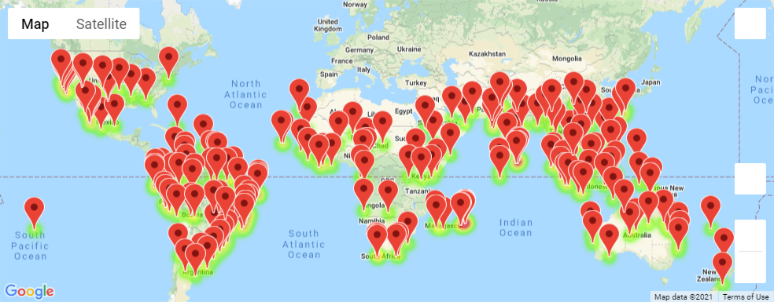
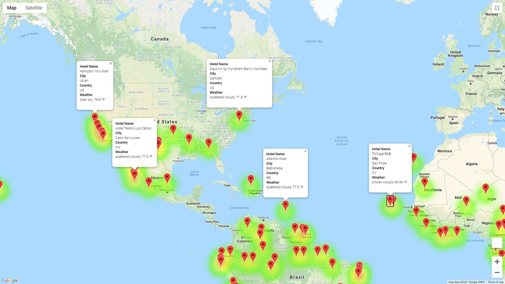
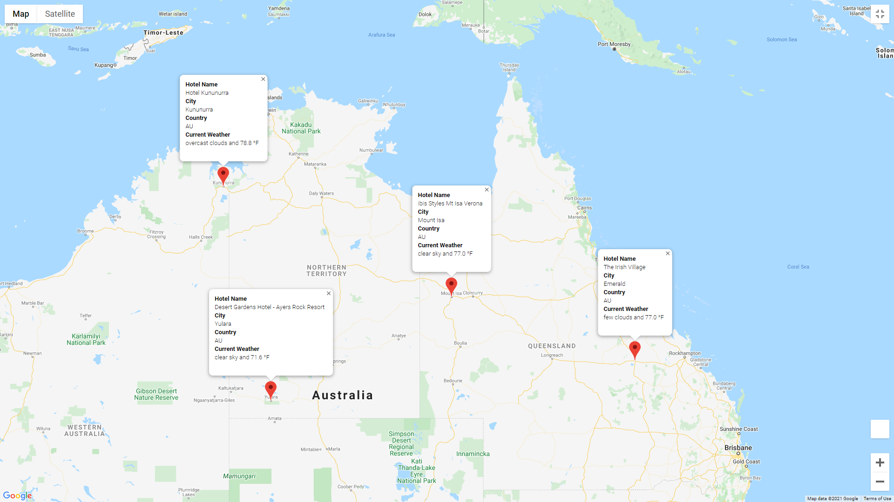

# World Weather Analysis

Module 6 Challenge

## Purpose

The purpose of this repository is to gather ideal vacation weather conditions through OpenWeatherMap API and then route the locations through Google Maps API to search for Hotels and then Directions and creating customized maps with markers.

## Resources
- Software: Anaconda 2020.11, Jupyter Notebook Server 6.1.4, Python 3.7.9, matplotlib 3.3.2, pandas 1.1.3, numpy 1.17.0, citipy 0.0.5, gmaps  0.9.0, requests 2.24.0
- API: OpenWeatherMap 2.5, Google Maps Platform

## Deliverable 1: Retrieve Weather Data

Utilize citipy, and make open API call to OpenWeatherMap

- The `Weather_Database` folder with the following:

- The [`Weather_Database.ipynb`](Weather_Database/Weather_Database.ipynb) file

- The [`WeatherPy_Database.csv`](Weather_Database/WeatherPy_Database.csv) file

## Deliverable 2: Create a Customer Travel Destination Map

- The `Vacation_Search` folder with the following:

- The [`Vacation_Search.ipynb`](Vacation_Search/Vacation_Search.ipynb) file
- The [`WeatherPy_vacation.csv`](Vacation_Search/WeatherPy_vacation.csv) file

- The `WeatherPy_vacation_map.png` image:

    

    

## Deliverable 3: Create a Travel Itinerary Map

- The `Vacation_Itinerary` folder with the following:

- The [`Vacation_Itinerary.ipynb`](Vacation_Itinerary/Vacation_Itinerary.ipynb) file

- The `WeatherPy_travel_map.png` image:

    

- The `WeatherPy_travel_map_markers.png` image:

    

## Conclusion

The gmap libraries are great, however they are not yet well integrated enough with Google in this Lesson Module to be shareable, this should be explored more . Also note that the shared config.py key required use of:

```
import sys
sys.path.append("../")
```

To allow Python to file the config.py one directory above.